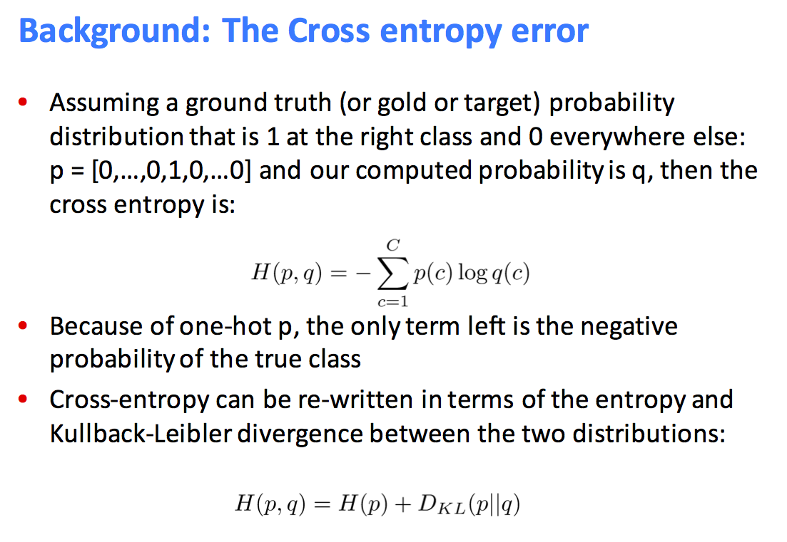
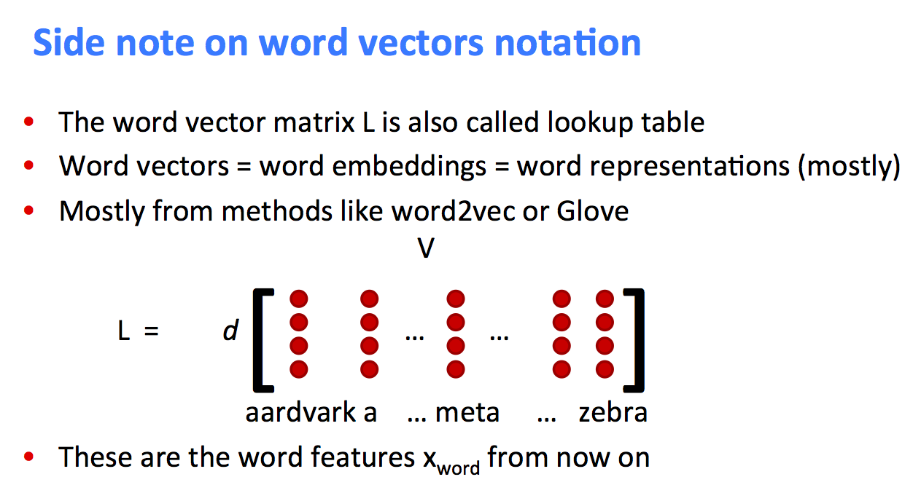

# learn-word2vec

## 1. Dot Product 

Inner product

Dot product is a measure of similarity, Euclidean distance and Pearson correlation is also a measure of similarity.

相似度可以用欧氏距离加一以后，取倒数。

偏度系数是一个取值通常在-3--3之间的值，它衡量了数据集的对称程度。偏度系数越接近0，这说明数据集越对称，越远离0则表明数据集越不对称。如果偏度系数为正，则表明他的数据在右边更为分散，若为负的，则说明他的左侧更为分散。峰度系数是用数据集的四阶中心矩来计算出来的。正态分布的峰度系数为3.峰度系数越接近0，就说明数据集的分布峰度与正态分布越相似。越远离0，数据集的分布峰度就越和正态分布不相似。如果说峰度系数为负，则表明数据集较为集中，两侧数据集较少。如果它为正则相反。如果偏度系数和峰度系数都为0的时候，则该数据集服从一个标准的正态分布。
当各维的数据中的某一维或者某几维的数据偏离正态分布，尤其是峰度偏离正态，更接近均匀分布的时候，欧式距离并不能很好的衡量两个向量的相似度，这时候更多的使用pearson's correlation coefficient来衡量两个向量的相似度。

pearson's correlation coefficient做拟合的时候，用的并不是least square的方法，而是用点到直线的距离去比上点到原点的距离，拟合的越好，pearson's correlation coefficient越接近1，两个向量越相关（线性的相关关系越强），相似程度越大。
用相关程度来衡量品味的相似度，修正了grade inflation的情况。A、B两人，有可能A的标准较高，B的标准较低，直接用欧氏距离会发现两个向量有距离，但用相关系数就没问题，其实，除了用相关系数，还可以简单比较两个向量的方向（向量夹角），或者把两个人的数据都normalize以后再求欧式距离。数据都normalize是可以解决grade inflation的问题，但是会引起什么新的问题现在还并不知道。
pearson's correlation coefficient在-1到1之间，从负相关到正相关。

Dot product和余弦相似性度量方法是类似的，余弦相似性度量方法是通过计算向量间的余弦夹角来度量用户间相似性的。Dot product受两个向量和向量夹角的影响，pearson's correlation coefficient和向量夹角余弦只和向量夹角有关。衡量向量相似性的话，一般说的就是衡量向量方向的相似性，但用内积处理比用向量余弦夹角更加简单好用。

修正cosine相似度的目的是解决cosine相似度仅考虑向量维度方向上的相似而没考虑到各个维度的量纲的差异性，所以在计算相似度的时候，做了每个维度减去均值的修正操作。余弦相似度未考虑到用户评分尺度问题，如在评分区间[1一5]的情况下，对用户甲来说评分3以上就是自己喜欢的，而对于用户乙，评分4以上才是自己喜欢的。通过减去用户对项的平均评分，修正的余弦相似性度量方法改善了以上问题。

Pearson correlation 相关系数主要考虑线性相关性，定义为两个变量之间的协方差和标准差的商，所以自然的考虑了均值的修正操作

uTv = u * v = sum(uivi)

Bigger if u and v are similar (向量方向一致，其中一个向量到另一个向量的投影较大，近似表示，处理更简单)

内积就是做投影，是一种相关运算，做内积的两个信号越相似，则内积的结果越大（一个信号在另一个信号上的投影越大），我们熟悉的连续时间傅立叶变换等都是内积运算。

## 2. Softmax function

pi = exp(ui)/sum(exp(uj))

u可能是线性函数（比如在multiple logistic regression中），也可能是简单的二次函数（比如坐标点乘）。

p常用于分类问题（一般是多个类别）的forward propagation的概率计算，用来根据x得到分类y。

如果ui表示周围向量和中间向量相似性（同类的相似性）的话，pi就是中间向量出现周围向量的概率。

## 3. Coocurrence matrix and low dimentional vector

Window based cooccurence matrix

Problems with simple cooccurrence vectors: Increase in size with vocabulary; Very high dimensional: require a lot of storage; Subsequent classifica4on models have sparsity issues

Low dimensional vectors: store “most” of the important information in a fixed, small number of dimensions: a dense vector; Usually around 25 – 1000 dimensions.

How to reduce the dimensionality?

Singular Value Decomposition of cooccurence matrix (Computational cost scales quadratically for n x m matrix; Hard to incorporate new words or documents)

PCA (principle component analysis)

对于用降维方法求dense vector，如果有新的数据进来，是没法迭代的，只能从头开始重新计算；对于用神经网络模型拟合dense vector，如果有新的数据进来，只需要以当前的dense vector为初始值，然后对包括新数据的所有数据进行拟合即可(full batch gradient descent)，是可以迅速收敛的，甚至只对新数据进行拟合(stochatic gradient descent)也可以（当新数据量很大，源源不断产生时）。

## 4. Skip-gram

此处，gram是grammar的缩写，表示word window，skip-gram意思是word window不断的移动，来做拟合。

Directly learn low-dimensional word vectors

Skip-gram是一种用神经网络模型（softmax classifier）直接拟合词汇向量的方法，用来得到各个词的low dimentional vector。

logistic classifier和softmax classifier，本质上就是神经网络模型，可以认为是广义的神经网络模型。

word2vec算法所得到的词汇向量，用的就是skip-gram的方法。word2vec is a neural network-based model.

word2vec算法可以认为是一个三层的neural network，第一层到第二层是word vector到相似度度量uTv的映射，第二层到第三层是softmax classifier的使用。

softmax classifier的分母，是所有词与center word的相似度度量uTv的加和，要用到所有词的word vector. 

Skip-gram拟合的核心是从中心词到周围词的预测，是word2vec算法forward propagation计算的核心算法。不管选择什么样的cost function，参数的选择以预测最准为目标。优化的cost function关注的就是从中心词到周围词的预测的概率，目标是实际情况的概率最大。

在cost function计算中，数据中出现的每个词都会充当center word，来看周围的word window，看其他词是出现在这个word window中，还是没有出现。如果用的是Cross entropy cost function，对于一个center word，周围词的出现概率取log后求和。对于不同的center word的结果，也就是各个cross entropy之间，也是要求和的。取负号后，求解最小化问题。

除了skip-gram，还有一种拟合word2vec的算法叫做CBOW，是给出word window中周围词的向量，求中心词的向量。再由中心词的向量来给出中心词的分类(一般用softmax来做)，看中心词到底是哪个词。

## 5. Cost function

Cost function是数据拟合中的优化目标，通过在back propagation中实现cost function的最优化，可以得到需要拟合的参数

## 6. Cross entropy cost function

两个概率分布之间的距离度量，常用于loss function或者cost function，特别是分类问题（一般是多个类别）的cost function

Kullback distance也可用于两个概率分布之间的距离度量（Kullback distance和Cross entropy本质上是一样的，也可以使用Kullback distance cost function）

CE(y1i,y2i)=-sum(y1i*logy2i)

负号是为了将最大化问题转化为最小化问题

对于多分类问题，只有实际分类的logyi项被保留。在word2vec中使用cross entropy cost function时，只有中心词周围出现的词的exp(uoTv)才会出现在分子中，然后取log。With one-hot wt+j target, the only term left is the negative log probability of the true class.

从中间词的选取，到周围词的选取，本来应该是概率相乘，取log以后变成了相加。

一般的softmax及cross entropy问题，分子中exp的值多是Wx，W是待拟合的系数，x是已知的变量set，Wx是线性函数，但是，对于word2vec中用到的softmax及cross entropy，分子中exp的值是uoTv，uo是待拟合的系数，v也是待拟合的系数，两组系数相乘，也不再是线性函数。

一般情况下，yi就用softmax function的pi来计算，对于从中心词到周围词的预测（skip-gram拟合word方法），参数包括所有词的向量

在图像识别中，yi中的i表示不同的图片，yi表示具体的图像分类；对于从中心词到周围词的预测，yi中的i表示不同的位置，yi表示具体的词汇分类

We may only update the word vectors that actually appear, only update certain columns of full embedding matrix U and V

p(c)是一个行向量，logq(c)是一个列向量，因为p(c)向量中只有一个元素是1，其他元素都是0，所以p(c)*logq(c)是一个值。

## 7. Logistic cost function

-sum(y*log(hx)+(1-y)*log(1-hx))

y=1 or 0

在logistic regression或者neural network中，可用于二分类问题，也可用于多分类问题

## 8. Negative sampling cost function

Main idea: train binary logistic regressions for a true pair (center word and word in its context window) and a couple of random pairs (the center word with a random word)

Negative sampling方法最重要的两个参数，一是random word的个数k，二是在随机选取random word时所用到的数学函数的参数（比如从什么样的分布中随机选取）。这两个参数的选取的合适程度，在很大程度上影响word2vec的最终结果的优劣。

Define negative prediction that only samples a few words that do not appear in the context

less frequent words be sampled more often

设计一个数学函数，使得词汇在某个词周围出现的次数越少（频率越低），被选到充当negative words的频率越高

Max. probability that real outside word appears, minimize prob. that random words appear around center word

log(sigma(uoTv)) + sum(log(sigma(-ujTv)) ------- 表达式（1）

-sum(y*log(sigma(uoTv)) + (1-y)*log(sigma(-ujTv))

结果与logistic cost function有相似的地方，此处的sigma指的是sigmoid function，也就是logistic function.

window中的某个位置的分类是某个词i，对这个词i来讲，yi=1

y=1: output word在window中
y=0: output word不在window中，是随机抽签的结果

参数包括y=1的词的向量，以及被随机抽中的y=0的词的向量，不像cross entropy cost function, 参数包括所有词的向量

对于某一个center word的vector v，是上面的表达式（1）。对于不同的center word的结果，也就是不同的v所对应的不同的表达式（1），要再次求和得到最终要优化的cost function.

负采样算法是怎样优化计算量的：优化前（普通的cross entropy算法），在计算center word周围出现某个词的概率时，是要用到所有词的vector的。所谓负采样，就是不再用到所有词的vector，对于在center word周围不出现的词，只随机取一个很小的子集，其word vector用于概率计算，所以计算量就减小了。

## 9. Sigmoid function

logistic function 

pi = 1/(1+exp(-ui))

## 10. Eigenvector and eigenvalue

从线性空间的角度看，在一个定义了内积的线性空间里，对一个N阶对称方阵进行特征分解，就是产生了该空间的N个标准正交基，然后把矩阵投影到这N个基上。N个特征向量就是N个标准正交基，而特征值的模则代表矩阵在每个基上的投影长度。
特征值越大，说明矩阵在对应的特征向量上的方差越大，功率越大，信息量越多。
应用到最优化中，意思就是对于R的二次型，自变量在这个方向上变化的时候，对函数值的影响最大，也就是该方向上的方向导数最大。
应用到数据挖掘中，意思就是最大特征值对应的特征向量方向上包含最多的信息量，如果某几个特征值很小，说明这几个方向信息量很小，可以用来降维，也就是删除小特征值对应方向的数据，只保留大特征值方向对应的数据，这样做以后数据量减小，但有用信息量变化不大。

## 11. 用gradient descent解决cost function的最优化问题

gradient descent：要求计算cost function相对待拟合参数的导数，即gradient

back propogation：本质上就是计算gradient，比如，derive the gradient for the internal vectors vc。当然，we also need gradients for outside vectors u

To minimize J(theta) over the full batch (the entire training data) would require us to compute gradients for all word windows

J(theta)就是以theta为参数的cost function

Substracting a fraction of the gradient moves you towards the minimum

Stochastic gradient descent (SGD): We will update parameters after each window t

Vanilla: 一个机器学习 Python 程序库，可以在需要Gradient Descent时使用。

Vanilla neural network指的是只有单层输入（不像RecurrentNN那样有额外的输入），对于一个样本也只有单个输出的neural network（不像RecurrentNN那样有一组输出，比如输出一组单词）。

## 12. 待拟合的参数

In our case with d-dimensional vectors and V many words, the dimention of the parameter theta is 2dV。

每一个word就可以充当center word，也可以充当outside word，所以最终维度乘以2.

Every word has two vectors

## 13. word2vec的结果的evaluation

用vector similarity (distributional similarity)来做evaluation，similar words should have close vectors.
可以通过向量之差来比较，比如，如果向量国王-王后=向量男人-女人，就表明是不错的结果。

## 14. output word vector and center word vector

Every word has two vectors: output word vector and center word vector.

In many machine learning problems, we will average the output word vector and center word vector of a word to get the feature vector of the word.

## 15. word vectors as features

## 16. 中文维基百科用于拟合Word2Vec

gensim用于拟合Word2Vec

Memory

At its core, word2vec model parameters are stored as matrices (NumPy arrays). Each array is #vocabulary (controlled by min_count parameter) times #size (size parameter) of floats (single precision aka 4 bytes).

Three such matrices are held in RAM (work is underway to reduce that number to two, or even one). So if your input contains 100,000 unique words, and you asked for layer size=200, the model will require approx. 100,000*200*4*3 bytes = ~229MB.

如果是300万个词，所需要的内存就是230*30=6900MB=6.9GB.

不仅是训练，哪怕只是导入词向量，如果300万个词的话，电脑的内存至少也要8G.

中文数据的下载地址是：https://dumps.wikimedia.org/zhwiki/latest/zhwiki-latest-pages-articles.xml.bz2。

以下谈到的python文件在这里：

[DuReader/wiki-word2vec/](https://github.com/arfu2016/DuReader/tree/master/wiki-word2vec)

首先用 process_wiki.py处理这个XML压缩文件，执行：python process_wiki.py data/zhwiki-latest-pages-articles.xml.bz2 data/wiki.zh.text

查看之后发现，除了加杂一些英文词汇外，还有很多繁体字混迹其中.

英文等外语词汇可以用正则去除掉，繁体字转简体字可以用[opencc-python](https://github.com/yichen0831/opencc-python)来完成。同时做分词，可以用jieba.

执行：python word_segment.py data/wiki.zh.text data/wiki.zh.text.seg

有了中文维基百科的分词数据，就可以执行word2vec模型训练了：

python train_word2vec_model.py data/wiki.zh.text.seg wiki.zh.model wiki.zh.vector

接下来，可以评估word vector的效果：

python zh_vector_evaluation.py

各种word vector

[word2vec](https://github.com/hankcs/HanLP/wiki/word2vec)

都不推荐，看过fasttext的词向量，质量不敢恭维；另外，30万词汇量是不够的，要上百万才行，最好300万。

